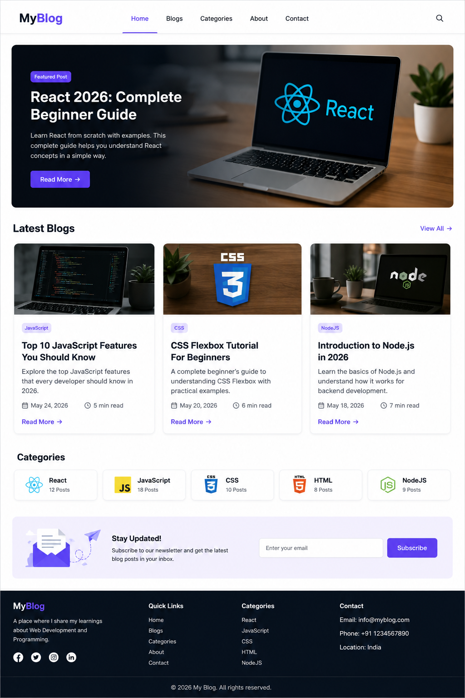
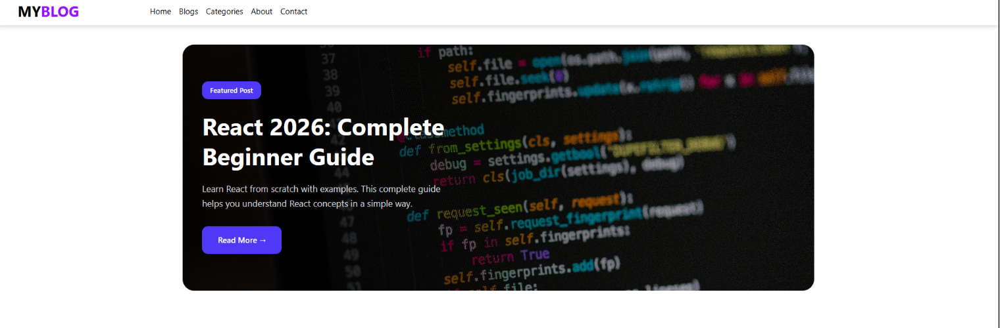
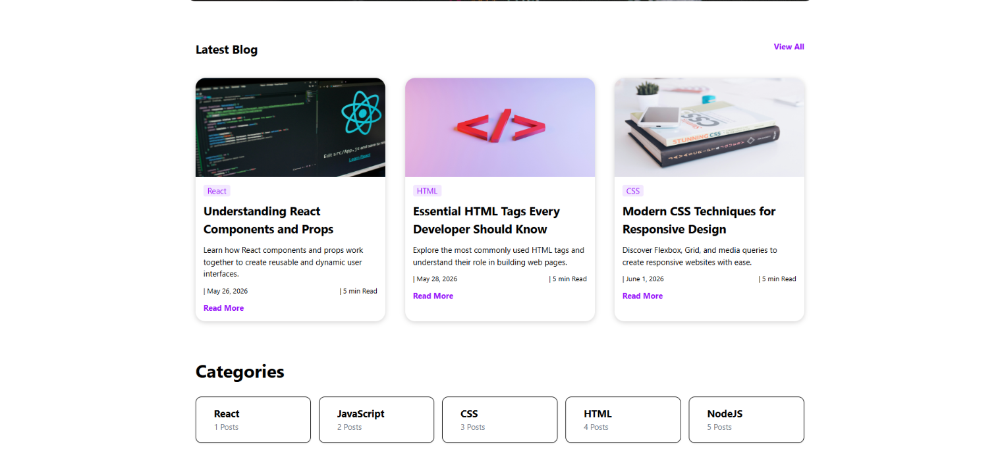
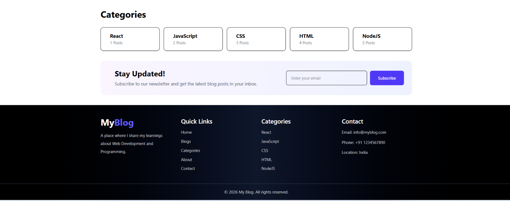

#  Blog Website



A simple and responsive **Blog Website** built using **React JS**, **Vite**, **Tailwind CSS**, **Axios**, and **JSON Server**.

This project helps beginners learn how to fetch data from an API and display it in a clean and responsive user interface.

---

## Features

-  Display blog posts
-  Fetch data using Axios
-  Load blogs from JSON Server
-  View All / Show Less blogs
-  Responsive Design
-  Modern UI with Tailwind CSS

---

##  Tech Stack

- React JS
- Vite
- Tailwind CSS
- Axios
- JSON Server

---

##  Project Preview

-  Home section 



- Blog & Category Section 



- Footer section


---

##  Folder Structure

```text
blog/
│── src/
│── public/
│── db.json
│── blogproject.png
│── package.json
│── vite.config.js
```

---

##  Installation

### Clone the repository

```bash
git clone https://github.com/harshit13525/Blog-project
```

### Go to project folder

```bash
cd blog
```

### Install dependencies

```bash
npm install
```

### Start the React app

```bash
npm run dev
```

### Start JSON Server

```bash
npx json-server db.json --port 3000
```

---

##  What I Learned

- React Components
- React Hooks (useState)
- Axios for API requests
- Working with JSON Server
- Conditional Rendering
- Mapping Arrays in React

---

## License

This project is created for learning and practice purposes.